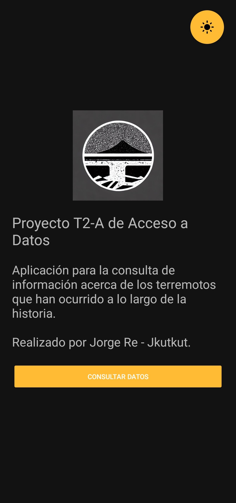
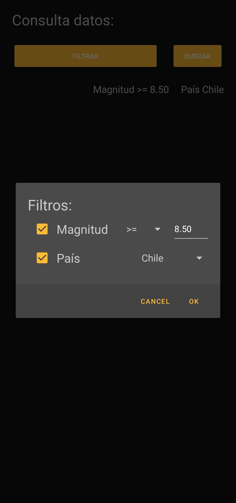
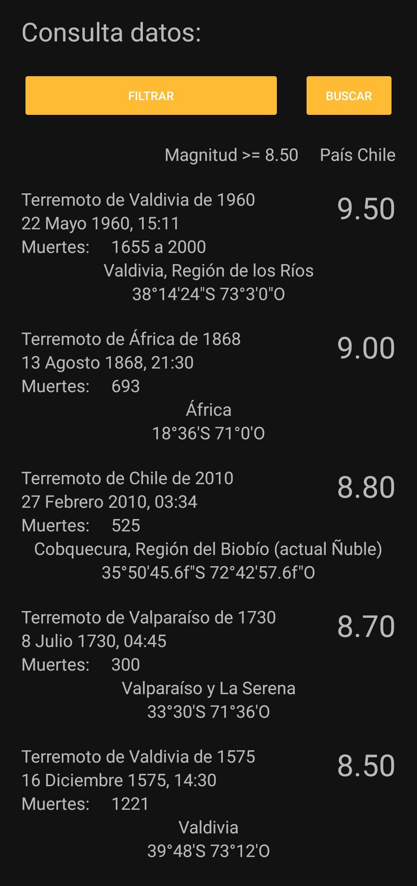

# Earthquake Data Query

This is a simple Android app that queries the SQL data from a SQLite database and displays it on the screen. It features some filters to narrow down the data.

||||
|:---:|:---:|:---:|
||||